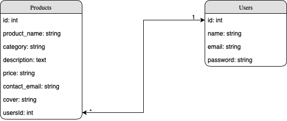

# Ruby on Rails CRUD

I think one of the quickest ways to learn a new language or framework is by doing a project. I built a [CRUD application](https://github.com/jameshuanguc/crud) before using Node.js, and now I rewrite it using Ruby on Rails!

Building the same web application using different languages/frameworks make me think of Rails is a rapid way to build an application comparing to Node.js, and Rails' code structure is more organized. But Rails is not flexible enough since I have to follow the Rails way to build the app. It's too high level and hard to customize the way I want.




# Run in Docker

```sh
docker-compose build
docker-compose up

# open another terminal
docker-compose run web rake db:create
docker-compose run web rails db:migrate RAILS_ENV=development

# Check it out in localhost:3000
```


# Demo

[https://ruby-on-rails-crud.herokuapp.com](https://ruby-on-rails-crud.herokuapp.com)
